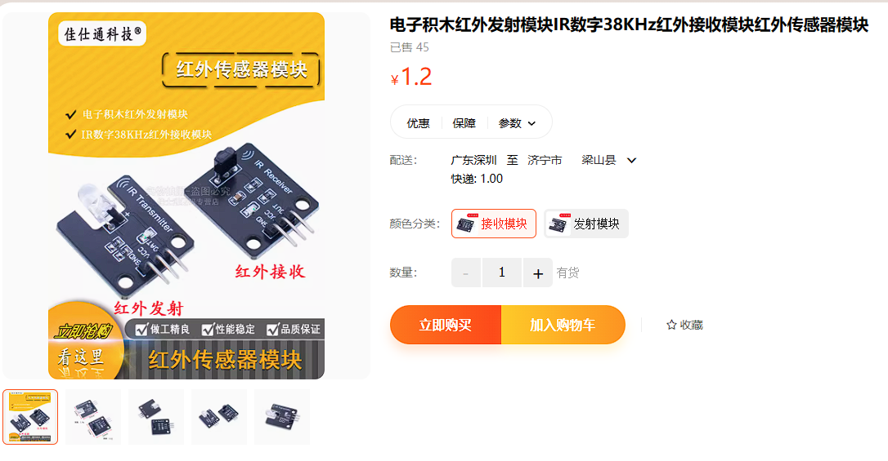
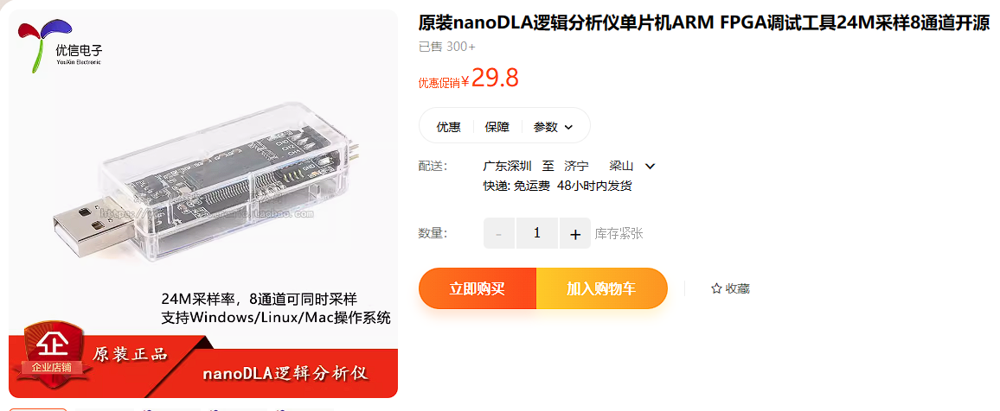
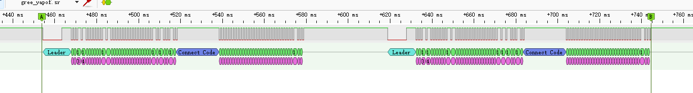
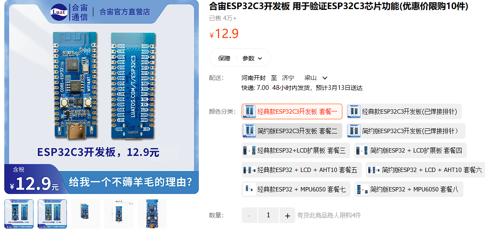

# IoT-RMT

## 项目初心
远程控制家中老式空调，当然市场上有很多产品，但都不提供对外接口，无法自定义，也无法加入各厂家的智能家居平台。短期内看不到统一的可能性，长期来看也不太可能。

## 所需软硬件

红外接收，红外发射模块

逻辑分析仪 + PulseView - 用于分析遥控器信号规则和后期调试。

ESP32c3 - 使用ESP IDF框架开发

## 原理
使用红外接收模块接收遥控器红外信号，送入逻辑分析仪中，解析出遥控器红外编码规则。
红外接收模块空闲时输出高电平，接收到红外信号后输出低电平。
以NEC红外协议为例，一定时间的低电平+一定时间高电平表示为1bit数据。
好难表达，以后再说吧，都能搜索到。

获取规则后，通过ESP32 IDF RMT库调制38KHz载波，使用RMT编码器将数据信号编码为RMT Symbol。
RMT的编码器有两种：
`rmt_new_copy_encoder()` 用来编码1bit数据，就是手填RMT Symbol里面的数据，它原封不动的复制过去。
`rmt_new_bytes_encoder()` 编码1Byte数据（8bit），根据`rmt_bytes_encoder_config_t`里面的设定将1字节数据编码为8个RMT Symbol。

搞定编码器后，就能直接发射红外信号了。